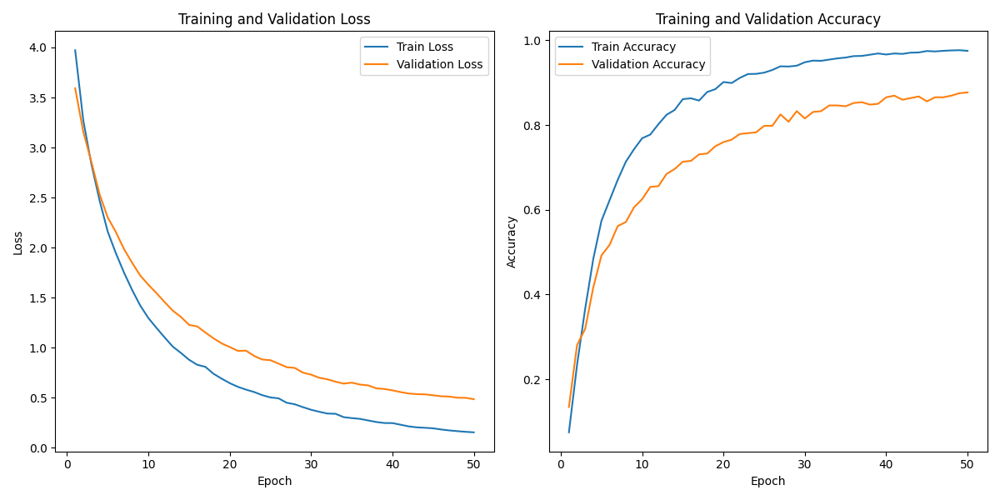

# Attention Bottlenecks for Multimodal Fusion (MBT) Implementation

This repository contains an implementation of Attention Bottlenecks for Multimodal Fusion (MBT) model for audio-visual classification. The model is designed to process both audio spectrograms and video frames, leveraging a combination of Vision Transformers (ViT) and Audio Spectrogram Transformers (AST) for feature extraction and fusion.

## Table of Contents
- [Overview](#overview)
- [Dataset](#dataset)
- [Model Architecture](#model-architecture)
- [Training](#training)
- [Results](#results)
- [Usage](#usage)
- [Dependencies](#dependencies)
- [License](#license)

## Overview

The goal of this project is to build a multi-modal transformer model that can classify videos based on both their audio and visual content. The model uses a combination of Vision Transformers (ViT) for processing video frames and Audio Spectrogram Transformers (AST) for processing audio spectrograms. The features from both modalities are fused using a latent fusion mechanism, and the final classification is performed using a linear classifier.

## Dataset

The dataset used for this project is the **PJZUF-C101** dataset, which contains video clips with corresponding audio and visual content. The dataset can be downloaded using the following command:

```bash
#!/bin/bash
curl -L -o ~/Downloads/pjzufc101.zip \
  https://www.kaggle.com/api/v1/datasets/download/pranjayyelkotwar/pjzufc101
```

The dataset is organized into two main directories:
- `video/`: Contains video files in `.mp4` format.
- `audio/`: Contains audio files in `.wav` format.

Each video and audio file is labeled with a class index, and the dataset is split into training and validation sets.

## Model Architecture

The model architecture consists of the following components:

1. **Audio Spectrogram Transformer (AST)**:
   - The AST processes the audio spectrograms using a Vision Transformer (ViT) with a 1D input channel.
   - The spectrogram is divided into patches, and the model learns to extract features from these patches.

2. **Vision Transformer (ViT)**:
   - The ViT processes the video frames, treating each frame as an image.
   - The frames are divided into patches, and the model learns to extract features from these patches.

3. **Latent Fusion**:
   - The features from the AST and ViT are fused using a latent fusion mechanism.
   - The fused features are then passed through a series of transformer layers for further processing.

4. **Classifier**:
   - The final features are passed through a linear classifier to produce the output logits.

The model is implemented using PyTorch and leverages the `timm` library for the Vision Transformer implementation.

## Training

The model is trained using the following steps:

1. **Data Loading**:
   - The dataset is loaded using a custom `CombinedDataset` class, which handles both audio and video data.
   - The dataset is split into training and validation sets.

2. **Model Initialization**:
   - The model is initialized with pre-trained weights for the Vision Transformer and Audio Spectrogram Transformer.
   - The model is moved to the appropriate device (GPU or CPU).

3. **Training Loop**:
   - The model is trained using the Adam optimizer with a learning rate of `1e-4`.
   - The training loop includes early stopping to prevent overfitting.

4. **Evaluation**:
   - The model is evaluated on the validation set after each epoch.
   - The training and validation losses, as well as accuracy, are logged and saved to a CSV file.

## Results

The training and validation losses are plotted over the course of training to monitor the model's performance. The results are saved in a CSV file (`training_log.csv`) and visualized using Matplotlib.

## Usage

To train the model, follow these steps:

1. **Install Dependencies**:
   - Ensure that all required dependencies are installed using the following command:
     ```bash
     pip install av librosa timm torch torchvision torchaudio
     ```

2. **Download the Dataset**:
   - Download the dataset using the provided command:
     ```bash
     curl -L -o ~/Downloads/pjzufc101.zip \
       https://www.kaggle.com/api/v1/datasets/download/pranjayyelkotwar/pjzufc101
     ```

3. **Run the Training Script**:
   - Run the provided Jupyter notebook to train the model.

4. **Monitor Training**:
   - Monitor the training process using the logs and plots generated during training.



## Dependencies

The following dependencies are required to run the code:

- `torch`
- `torchvision`
- `torchaudio`
- `timm`
- `librosa`
- `av`
- `numpy`
- `pandas`
- `matplotlib`
- `tqdm`

## License

This project is licensed under the MIT License. See the [LICENSE](LICENSE) file for details.